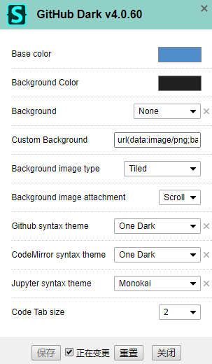

# scripts & styles

给 Tampermonkey 用的脚本和给 Stylus 用的样式

## 我写的

### remove-adds.css


[](./css/remove-adds.user.css) [](https://userstyles.org/styles/178935/remove-adds)

移除广告

### remove-adds.js


[](./scripts/remove-adds.user.js) [](https://greasyfork.org/zh-CN/scripts/393030-removeadds)

移除广告

### BilibiliEnhanced


[](./scripts/bilibili-enhanced.user.js) [](https://greasyfork.org/zh-CN/scripts/380783-bilibilienhanced)

1. 首页删除广告
2. 视频时关闭弹幕、自动宽屏
3. 直播时关闭弹幕

### GitHubGoTop


[](./scripts/.user.js) [](https://greasyfork.org/zh-CN/scripts/392584-githubgotop)

GitHub 增加“一键返回顶部”按钮

### GitHubHideDesktop


[](./scripts/github-hide-desktop.user.js) [](https://greasyfork.org/zh-CN/scripts/392623-githubhidedesktop)

GitHub 隐藏与“GitHub Desktop”相关的按钮

### github-update-forked


[](./scripts/github-update-forked.user.js) [](https://greasyfork.org/zh-CN/scripts/393205-github-update-forked)

GitHub 更新 fork仓库

### utils


[](./libraries/utils.user.js) [](https://greasyfork.org/zh-CN/scripts/393085-commonsutil)

一些公用方法

### css


[](./libraries/css.user.js) [](https://greasyfork.org/zh-CN/scripts/393202-cssutil)

一些常用 css 方法

## 别人写的

推荐一些别人写的的脚本、样式及我的设置~

### StylishThemes/GitHub-Dark-Script


[](https://greasyfork.org/zh-CN/scripts/15562-github-dark-script)

设置:



### Mottie/GitHub code show whitespace


[](https://greasyfork.org/en/scripts/28454-github-code-show-whitespace)

设置:

```json
{
    "show-whitespace": "true"
}
```

### Mottie/GitHub collapse markdown


[](https://greasyfork.org/en/scripts/20974-github-collapse-markdown)

设置:

```json
{
    "ghcm-collapsed": false,
    "ghcm-colors": [ "#0066ff", "#3271b9", "#769fcd", "#b9d7ea", "#d6e6f2", "#f7fbfc" ]
}
```
